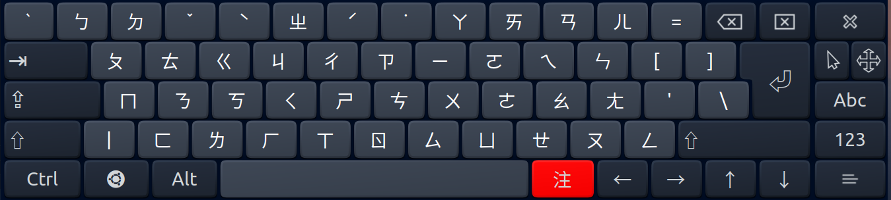
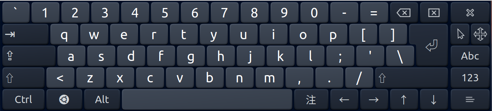

# Zhuyin Keyboard Layout for onboard
可搭配注音輸入法使用的Onboard配置

# Install
Onboard Setting > Layout > Open layouts folder > Drop files into folder
# Usage

Onboard Setting > Layout > Select "zhuyin"

# License

[GPL3](./LICENSE)

